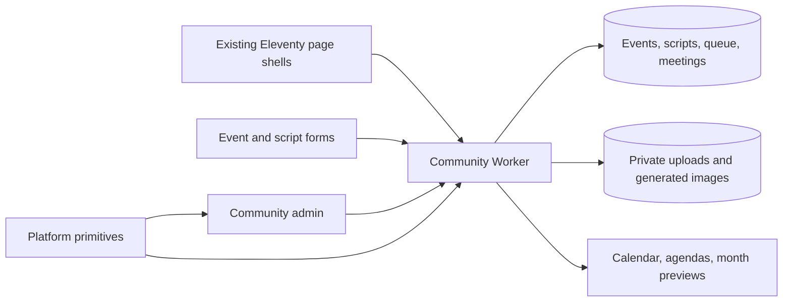

# Microcinema calendar and Writers Group scheduling

Status: approved scope and implementation plan, September 8, 2026. The owner
authorized implementation and completion after supplying the administrator
address. Implementation, staging and production are now in place; see the
[launch evidence](../qa/2026-09-08-community-launch.md). The
[Community Worker guide](../../workers/community/README.md) is authoritative
for the implemented configuration, commands and release procedure.

## September 10 implementation update

Admins can create, edit and delete events and Writers Group meetings using the
shared editor and confirmation controls. Deleted records are hidden from both
public projections and retained internally to prevent recurrence regeneration.
Deleting a future meeting reallocates its scripts; past reading history remains
locked even if the meeting date changes. The public script form is always
visible, mounts the existing responsive Turnstile control immediately, and has
no trailing divider. Public upload grants remain protected by server verification.

## Confirmed scope

- Microcinema events take place at Dust Wave HQ only.
- Visitors submit an event name, one-sentence description, date, time, and small
  square image. An administrator reviews submissions before publication.
- The calendar starts on the current Albuquerque month, offers the following
  two months, and permits backward navigation to the first month with an event.
- Every month has a shareable URL with its own title and calendar image in
  social previews.
- Writers Group meets every other Monday, 7–9 p.m., starting September 21, 2026.
  Scripts remain limited to 35 pages each. Two approved scripts automatically
  fill each meeting in queue order.
- Writers submit private PDFs. Public meeting agendas show script titles and
  author names, with no script download or link.
- Writers Group meetings also appear on Microcinema, using the same records.
- A dedicated Community admin page has an independent user directory and
  supports submission editing, approval, and queue reordering. Super-admins
  also manage users; Limited-admins have the same event, meeting and script
  tools. The September 10 refinement replaces the original email allowlist
  with Store-style roles and makes alonso@dustwave.xyz the initial Super-admin.

The attached Hyperreal calendar is visual reference material. Its event content,
branding, weekday-only schedule, and any text in the image are not product rules
or seed data.

## Context checked

Read the [site README](../../README.md), [development](../development.md),
[publishing](../content-publishing.md), [testing](../testing.md),
[Podcast integration](../podcasts.md), [roadmap](../roadmap.md), and
[Newsletter Worker guide](../../workers/newsletter-subscribe/README.md).
Inspect the current sources again before implementation; the live English
Microcinema and Writers Group pages were also visually reviewed for this plan.

Relevant implementation seams:

| Existing source | Reuse or constraint |
|---|---|
| [Microcinema](../../src/microcinema.njk), [Writers Group](../../src/writers-group.njk) | Both use the default site layout and shared Writers Group classes. Add schedules immediately after the hero, before visit/meeting information. |
| [Theme styles](../../src/scss/themes/base/_style-theme.scss) | Existing cream date tile, heavy headings, ruled sections, paper framing, and page accent variables; Microcinema uses blue and Writers Group orange. |
| [Share panel](../../src/_includes/snippets/share-panel.njk) | Existing native sharing, copy link, and social links; currently assumes the static page URL. Parameterize its URL/title and scope its controller. |
| [Social metadata](../../src/_includes/snippets/meta-social.njk) | Existing canonical, language alternates, Open Graph, and Twitter metadata need selected-month values in the HTTP response. |
| [Platform README](../../shared/dust-wave-platform/README.md), [boundary ADR](../../shared/dust-wave-platform/docs/adr/0001-shared-repository-boundary.md) | Reuse versioned primitives; the site retains domain rules, storage, sessions, routes, and deployment. |
| [Platform pin test](../../tests/platform-pin.test.mjs) | Verified checkout is `2e79a8d70cb6d30805ea141e53d32f9387441756`; Admin Shell is `0.10.2`, Worker Core is `0.6.0`. Reuse this pin first. |
| [Gulp](../../gulpfile.js), [module versioning](../../scripts/version-module-imports.mjs) | Shared admin browser modules already have an asset-copy path. Runtime calendar selectors must survive production CSS purging. |
| [Hosting headers](../../_headers), [deployment guide](../development.md#deployment) | Production uses GitHub Pages behind Cloudflare. Header policy is applied at the edge; Pages does not apply `_headers` itself. |

There is currently no event store, community submission API, script queue, or
community authentication backend in this repository. Platform's passwordless
session module coordinates browser requests; it does not provide the server's
login, permission, or storage implementation. Media Core's current exports are
audio contracts, not a general image/PDF upload service.

## Public experience

### Microcinema

Use the reference's poster-like month heading, strong rules, oversized day
numbers, and dense event typography in the existing black/cream/blue palette.
Keep the schedule itself level and legible; paper framing can use the site's
existing restrained treatment. Use seven days, Monday through Sunday, so weekend
events remain visible.

Each event displays its title, one-sentence description, local start time, and
square thumbnail. Multiple events on a date stack in time order. Do not silently
clip events to make a cell fit. Narrow screens use a chronological agenda with
the same large date tiles and all the same event information. Provide a list
view on larger screens too; use semantic lists and `time` elements rather than
an interactive ARIA grid that implies spreadsheet keyboard behavior.

Navigation offers Previous, Current month, Next, and a month/archive selector:

- Compute the current month on the server in `America/Denver`, independently of
  the visitor's timezone or the last site build.
- The maximum visible month is current month plus two, including empty months.
- The earliest archive month comes from approved public event history, never
  rejected/pending submissions. Keep intervening empty months navigable.
- If no public history exists, show the current month and the next two, with
  Previous disabled. An empty calendar says there are no announced events.
- Preserve a month's URL when its last event is cancelled or withdrawn; show an
  empty/cancelled state rather than silently changing the selected month.
- Retain past months, multiple same-day events, and cancellation information.
  Admins may backfill historical events and plan beyond the public horizon.

Proposed month URL:
`https://dustwave.xyz/microcinema.html?month=2026-09#calendar`.
The Spanish equivalent preserves the same month. Canonical and Open Graph URLs
include the month but omit the fragment and unrelated tracking parameters.
The base page remains the rolling current-month entry point. Month links work
with ordinary page navigation and browser Back/Forward; JavaScript is optional
for reading and changing months.

Reject malformed, duplicate, impossible, or out-of-range month parameters with
an explicit unavailable-month state and a current-month link. Never make a
shared September URL silently display October. A successfully loaded month's
share controls always use its explicit month URL, including on the base page.

The submission form also collects a private contact name/email. Label it
clearly as an event proposal subject to approval, not a confirmed space booking.
Use plain text, a suggested 100-character title and 240-character description
limit, and optional admin-only end time. These are proposed implementation
defaults, not additional owner-confirmed requirements.

### Writers Group

Add an Upcoming readings list immediately after the hero. Each row has a large
date tile, 7–9 p.m. local time, and up to two `Script title — Author` entries.
The first dates are September 21, October 5, October 19, November 2, November 16,
and November 30, 2026. These follow the confirmed recurrence; admins can record
holiday cancellations or exceptions before publication.

Show six upcoming meetings initially, with More dates if there are additional
published meetings. A meeting with fewer than two scripts stays visible and
identifies open reading slots. A meeting remains visible while in progress and
leaves the upcoming list after its local end time. Update the existing copy
that tells visitors to contact the group merely to establish meeting dates.

The form asks for script title, public author name, private contact name/email,
page count, private PDF, and confirmation that the writer is based in the
Albuquerque area and can attend. Proposed default: self-attestation plus admin
review, without accounts or geolocation. Submitters consent to displaying the
title and author after approval. Contact details and PDFs never enter the
public HTML, API projections, image previews, logs, feeds, or build artifacts.

## Scheduling and administration

Treat the approved script queue and the derived meeting assignments as one
workflow. Pending or rejected scripts cannot occupy a slot.

1. Approval appends a script to the approved queue unless an admin chooses a
   different position. Use approval order, with a stable identifier tie-breaker.
2. Allocate scripts in pairs to future, non-cancelled meetings in chronological
   order. The first two go to September 21, the next two to October 5, etc.
3. Editing queue order previews the resulting dates and affected agendas. A
   single Save queue and schedule action persists the order and assignments.
   Proposed default: all future, not-yet-started meetings can change; past and
   in-progress agendas are preserved.
4. Cancellation or an approved script withdrawal previews the resulting
   reallocation before saving. Completed/read scripts leave the active queue
   and retain their historical assignment. Admins can explicitly requeue an
   unread script after a meeting; time passing alone does not claim it was read.
   Scripts assigned to a started meeting are excluded from future allocation
   unless explicitly requeued, even when their read status has not been recorded.
5. Keep future occurrences materialized with a unique series/date key. Extend
   the series idempotently to cover at least the rolling public horizon and all
   approved queued scripts. Generate dates with local calendar arithmetic,
   preserving 7 p.m. across daylight-saving changes. Explicit date exceptions
   survive regeneration.

Worker scheduled maintenance extends the rolling horizon. Persist assignments
on admin changes or horizon extension; public GET requests remain read-only.

The server, not the browser, owns this algorithm. Reordering, approvals, and
cancellations carry an expected queue revision. A conflicting save returns a
refresh-and-review response; it cannot partially change order or double-book a
script. Use conditional writes and a transaction whose later statements are
guarded by the successful revision claim. A zero-row conditional update is not
itself a transaction failure. [D1 batches provide transactional execution](https://developers.cloudflare.com/d1/worker-api/d1-database/#batch).

Community admin has three sections: Events, Script queue, and Meetings. Reuse
Platform tabs, dialogs, dirty-state controls, and unsaved-change protection.
Support create/edit/approve/reject/cancel for events, script metadata/PDF
replacement and approval, and meeting exceptions. Provide drag-to-reorder plus
Move up/Move down controls and announcements for keyboard users. Unsaved edits
remain private; saving changes to published information is clearly labeled.
Record actor, timestamp, revision, and action in the audit trail.

## Architecture and DRY boundaries

Add one site-owned Worker at `workers/community/`, with D1 for structured data
and private R2 storage for uploads. Both features use it. Keep the existing
Newsletter and Podcast services independently deployed.

Use narrow Cloudflare routes for the two English/Spanish public pages and
`/api/community/*`. The Worker fetches the existing Pages HTML shell, fills
explicit schedule placeholders, and updates selected-month metadata with
[HTMLRewriter](https://developers.cloudflare.com/workers/runtime-apis/html-rewriter/).
Its [route configuration](https://developers.cloudflare.com/workers/configuration/routing/routes/)
must be verified against the current zone before activation. All other pages
continue through their existing hosting path.

This produces real calendar content and correct month metadata in the first
HTTP response, including for crawlers and visitors without JavaScript. Fetch
and validate data before streaming the transformed response so a failed lookup
does not truncate the page. If the service cannot load a schedule, preserve the
informational page with an explicit schedule-unavailable message.

The Worker owns one public calendar renderer and one meeting-list renderer.
Grid/list layouts share a date/event view model; the month image consumes that
same model. Public navigation uses real links initially, avoiding a second
browser implementation of calendar rendering. The site build and Worker bundle
consume the existing locale catalogs. Add a narrow contract version to page
placeholders so incompatible shell/Worker releases fail visibly and can be
rolled back independently.

| Concern | Existing primitive or local ownership |
|---|---|
| HTTP, crypto, dates, timezone, bot validation | Worker Core `http`, `crypto`, `date-time`, `timezones`, `turnstile` |
| API requests, login flow, admin interaction | Admin Shell `api-client`, `passwordless-session`, `tabs`, `confirmation-dialog`, `unsaved-changes`, `dirty-controls`, `turnstile` |
| Private PDF download | Admin Shell `credentialed-download` with PDF allowlist and size limit |
| Page look, form markup, localized copy | Existing site templates, theme variables, and English/Spanish catalogs |
| Public sharing | Parameterized existing share panel and controller; ordinary untagged month links need no new marketing system |
| Event records, approval, recurrence, queue rules, image layout | New consumer-owned modules in this repository |

Do not add calendar domain tables or an application shell to Platform. Do not
copy Podcast/Pool/Store routes or read their databases. If implementation finds
an exact reusable gap, characterize it in each affected consumer, release the
small primitive through Platform, then update the immutable pin and rollback
evidence. No Platform package change is currently required by this proposal.

### Records and API contract

Use a single `events` record for each screening or Writers Group meeting,
including ID, kind, local date/time, timezone, publication state, public copy,
image reference, private submitter reference, and revision. A recurrence series
owns meeting defaults and exceptions; date/time is not duplicated on agendas.
Use `script_submissions`, `meeting_readings` (event ID, script ID, slot), upload
records, queue revision/order, admin sessions, and audit records as related
tables. Store any publication revision needed to keep a saved draft distinct
from its approved public representation.

Proposed endpoint groups under `/api/community/v1`:

- Public GET: calendar month/bounds, upcoming meetings, published event images,
  and revision-specific month preview images.
- Public POST: bounded upload initialization/finalization and event/script
  submission. Repeated submission keys return the original receipt.
- Admin auth: start/exchange/session/logout, matching Platform's coordinator.
- Authenticated admin: events and scripts, moderation, queue preview/save,
  meeting exceptions, and private PDF downloads.

Public responses use explicit field allowlists. Private data stays in the
Worker's private data path and is never serialized then hidden with CSS.
Publication changes the public projection without requiring a Pages rebuild.

### Uploads, identity, and previews

R2 access stays behind the Worker; its binding supports internal object access
without exposing the bucket. [R2 Workers API](https://developers.cloudflare.com/r2/api/workers/workers-api-reference/).
Use purpose-bound, short-lived upload grants, server-generated object keys,
streaming byte limits, and idempotent finalization. Incomplete uploads cannot
create approved records. Propose 5 MB input images and 10 MB PDFs; bound decoded
image dimensions and verify file content in addition to extension/MIME.

Images accept JPEG/PNG/WebP, offer a square crop preview, and produce small
validated square derivatives, approximately 320 and 640 pixels. Serve only
approved derivatives publicly. Keep originals and pending images private.
Reject active formats such as SVG as uploads. Strip unnecessary metadata and
use fixed-size image slots to prevent layout jumps.

PDFs remain private permanently unless an owner changes this product scope.
Validate a readable, non-encrypted PDF and the 35-page maximum on the server
with a bounded parser selected during the upload spike; do not trust the typed
page count. Serve downloads only to authorized Community admins, as attachments
with no-store and nosniff headers. Public visitors and guessed object IDs cannot
retrieve a file. Failed PDF validation leaves a useful form error and no queued
script. Proposed retention default: expire abandoned uploads after one day;
retain accepted PDFs for admin-managed removal, with the policy disclosed in
the form. Final retention policy can be adjusted before launch.

Reuse Platform's Turnstile controls and verification adapter for submission and
login, with consumer-owned hostname/action checks and rate limits. Client-side
tokens require [server verification](https://developers.cloudflare.com/turnstile/get-started/server-side-validation/).
Submission success gives an on-page receipt and pending-review status. Public
submitter accounts, self-service edits, and announcement/reminder emails are
outside the first version; admin login email is part of authentication only.

Implement separate Community email-login endpoints with single-use expiring
tokens, secure HttpOnly sessions, CSRF checks, and the separate user directory.
Reuse the platform's protocol and helpers; keep membership and role assignments
independent of every other product. See the [Worker guide](../../workers/community/README.md#users-and-roles)
for the implemented user-management policy and migration.
Prefer same-origin API paths, consumer-specific cookie names and scope, and
no-store admin responses. Test production header transforms as well as staging
headers; the existing admin CSP must allow exactly the resources this UI uses.

Month social cards are actual 1200×630 PNG images containing the month heading,
day grid, and a compact version of the published events. Their URL includes
month, locale, and public revision; the month page URL stays stable. Generate
cards from the same approved month view model, persist completed images, and
change metadata only to a ready asset. Empty months have a month-specific card.

Implemented image adapters: the Cloudflare Images binding normalizes submitted
images. The portable resvg WASM renderer generates month PNGs using bundled
Inter Bold, and private R2 stores the resulting immutable public assets. A real
PNG was validated locally and fetched from staging. This avoids a separate
browser rendering service. PDF validation uses pdf-lib with actual page counts.
Login email uses the existing Cloudflare Email Service sender domain, through a
restricted binding; the browser retains the Platform passwordless protocol.

Changing approved event details or a Writers Group agenda refreshes affected
month projections/cards. HTML cache keys include locale, selected month, public
revision, and shell version; bound the no-month page by the next local month
boundary. Start with uncached dynamic HTML if revision-aware caching would add
complexity. Check that Cloudflare rules preserve query distinctions. Social
platforms can retain their own previous previews; verify fresh crawler fetches
and representative real shares separately.

## Execution sequence

Each phase should leave a reviewable result. Production activation follows
staging acceptance; the owner subsequently authorized completing the work.

| Phase | Concrete work | Exit evidence |
|---|---|---|
| 1. Contracts and visual proof | Define schemas, queue behavior, route/metadata contract, and fixtures. Build calendar/agenda/admin previews in the existing shells. Prove image composition and bounded PDF validation in the intended runtime. | Desktop and phone review; month image sample; deterministic allocation of six scripts across three meetings; recorded provider/runtime prerequisites. |
| 2. Backend and submissions | Add `workers/community/` with migration/test/deploy scripts, D1/R2 bindings, public projections, separate admin auth, upload lifecycle, and moderation. | Pending submissions stay private; approved records load publicly; unauthorized PDFs denied; retry and partial-upload tests pass. |
| 3. Admin and automatic scheduling | Add localized `/admin/community/` shells, reuse Platform controls, implement event/script editors, queue reorder preview/save, two-script allocation, recurrence exceptions, and audit. | Keyboard reorder and concurrent-save tests pass; affected dates match preview; past/in-progress agendas stay stable. |
| 4. Public pages and sharing | Add schedule placeholders, public renderer, shared styles, scoped form/share scripts, edge composition, explicit month links, and ready month images. | Direct URLs, initial HTTP metadata, Back/Forward, EN/ES switching, empty archives, and first/last-month limits verified. |
| 5. Integration and launch | Run required site/Worker gates, stage real upload/login flows, enter approved admin identities and seed content, verify headers/cache, then perform an explicitly authorized release. | Staging record, independent Pages/Worker deployment results, public month-card fetches, private-file denial, real browser checks, and rollback procedure. |

Likely site edits: the two page templates; shared schedule/form snippets under
`src/_includes/`; Community controllers under `src/js/`; page styles using
existing theme variables; a separate Community admin bundle; locale catalogs
and route config; share/social metadata; Gulp extraction and asset versioning;
hosting validators; and focused Community tests. Keep new runtime-rendered
markup visible to PurgeCSS's source extraction. Explicitly extend i18n checks
to Community browser modules and rendered pages: current rendered-i18n checks
cover Podcast routes and would not prove the new UI by themselves.

## Acceptance and release checks

- Time: local midnight/month rollover, December–January, February/leap years,
  daylight-saving transitions, 4–6-week month layouts, and event end times.
- Calendar: first historical month, gaps, empty current/future months, archived
  links after cancellation, multiple events, long titles, and absent images.
- Queue: zero/one/two/three scripts, approval order, reorder, concurrent edits,
  cancellation, withdrawal, requeue, recurrence exceptions, and preserved history.
- Privacy: pending/rejected content absent from public outputs; no PDF/contact
  fields in HTML, JSON, social images, or artifacts; direct file access denied.
- Forms: invalid/oversize files, encrypted or overlength PDFs, expired/replayed
  tokens, duplicate submits, connection loss, retry, and visible success/errors.
- Rendered UI: 360/390-pixel phones, tablet, desktop, keyboard, zoom, screen-reader
  announcements, reduced motion, EN/ES, and long-content fixtures.
- Sharing: initial HTML has the selected month in title/canonical/OG/Twitter
  metadata; its real image returns the right month and dimensions; language
  links preserve selection; origin and edge cache behavior are checked.
- Resilience: unavailable D1/image service, mismatched shell version, direct
  Pages fallback, month rollover without rebuilding, and production CSS purge.

Add focused Community behavior/integration tests and Worker `npm test` as part
of implementation. Run existing relevant checks (`test:public-shell`, `test:i18n`,
`test:platform-pin`) during integration. Before release run `npm run check:podcasts`,
`npm run build:ci`, the new Community checks, and `git diff --check`.
If Platform changes, also run its `npm test` and consumer characterization gates.

Preserve independent rollback: deploy compatible page placeholders first, then
activate narrow Worker routes. Disabling those routes restores informational
Pages content and its honest schedule-unavailable state. Revert the Worker and
site separately; keep additive database migrations and private uploads intact.
Store operational guidance beside the new Worker and link it from the maintained
guides. No maintained material belongs in generated `dev/` or `docs/`.

## Seed content

The owner supplied the first Community admin address, now held in runtime
configuration and the restricted email binding. Production starts with the
confirmed meeting series and an empty script queue. No other event titles,
authors, PDFs or holiday exceptions were provided; admins can enter or approve
those as they arrive. They are not prerequisites to using the implemented flows.
